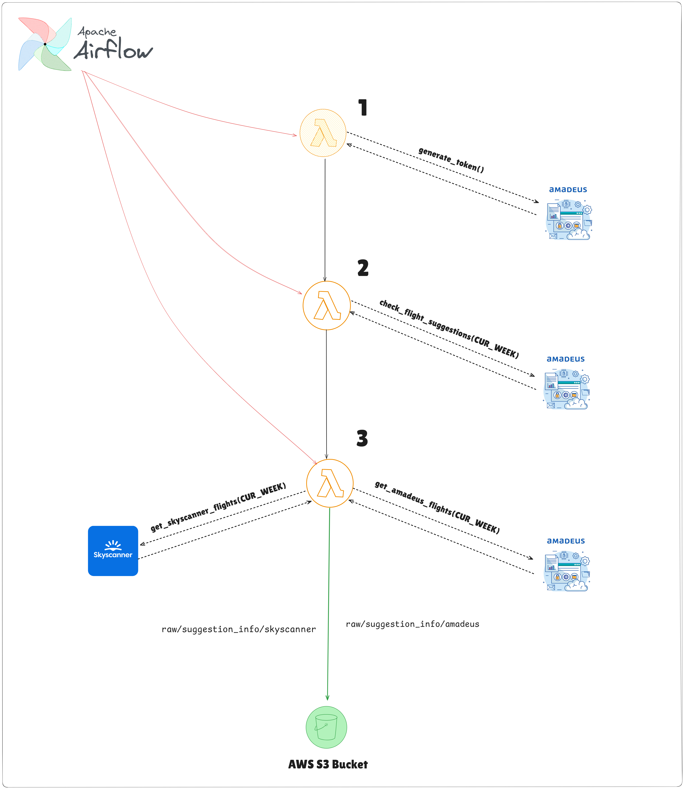

# Data Engineering Project
Data engineering using cloud tools for turism data management

## Steps

### Extract data from amadeus and Skyscanner

### Transform Raw Data

### Create Analytics tables

## Pasos para Crear un Data Pipeline

1. **Definición de Objetivos y Requerimientos**
    - **Objetivo**: Crear un pipeline de datos que recolecte y procese información sobre turismo, vuelos, alquileres de vehículos y alojamientos.
    - **Requerimientos**: Seleccionar APIs, herramientas de ingestión, orquestación, almacenamiento y visualización.

2. **Selección de APIs**
    - **Amadeus API**: Para datos de vuelos, hoteles y alquileres de vehículos. En este caso solo nos enfocamos en hoteles y alquileres
    - **Skyscanner API**: Para datos de vuelos.
    - **INE API**: Para estadísticas de turismo.

3. **Ingestión de Datos**
    - **Herramienta**: Python
    - **Proceso**:
        1. Escribir scripts en Python para recolectar datos de las APIs.
        2. Guardar los datos crudos en Amazon S3 para almacenamiento intermedio.

4. **Almacenamiento Intermedio**
    - **Herramienta**: Amazon S3
    - **Proceso**: Subir los datos recolectados en formato JSON o CSV a un bucket de S3.

5. **Orquestación y Automatización**
    - **Herramienta**: Apache Airflow
    - **Proceso**:
        1. Configurar DAGs (Directed Acyclic Graphs) en Airflow para automatizar la ingestión de datos desde las APIs y su almacenamiento en S3.
        2. Programar tareas para la transformación de datos.

6. **Transformación de Datos**
    - **Herramienta**: DBT (Data Build Tool)
    - **Proceso**:
        1. Crear modelos en DBT para limpiar y transformar los datos almacenados en S3.
        2. Generar tablas maestras con los datos procesados.

7. **Carga de Datos a PostgreSQL**
    - **Herramienta**: Python y/o Airflow
    - **Proceso**:
        1. Escribir scripts en Python o tareas en Airflow para cargar los datos transformados desde S3 a PostgreSQL.
        2. Utilizar librerías como `psycopg2` para la conexión y carga de datos a PostgreSQL.

8. **Almacenamiento Final**
    - **Herramienta**: PostgreSQL
    - **Proceso**: Crear tablas en PostgreSQL para almacenar los datos transformados.

9. **Visualización de Datos**
    - **Herramientas**: Tableau, Power BI o cualquier herramienta de BI que prefieras
    - **Proceso**:
        1. Conectar la herramienta de BI a PostgreSQL.
        2. Crear dashboards y visualizaciones basadas en las tablas maestras.

### Resumen del Pipeline

1. **Ingestión de Datos**: Scripts en Python para recolectar datos de APIs y almacenar en S3.
2. **Almacenamiento Intermedio**: Amazon S3 para almacenamiento de datos crudos.
3. **Orquestación y Automatización**: Airflow para automatizar la ingestión y transformación de datos.
4. **Transformación de Datos**: DBT para limpiar y transformar los datos.
5. **Carga de Datos**: Scripts en Python para cargar datos transformados desde S3 a PostgreSQL.
6. **Almacenamiento Final**: PostgreSQL para almacenamiento de datos estructurados.
7. **Visualización**: Herramientas de BI conectadas a PostgreSQL para crear dashboards.

Este enfoque te permitirá construir un pipeline de datos eficiente y escalable, utilizando herramientas modernas y accesibles.

